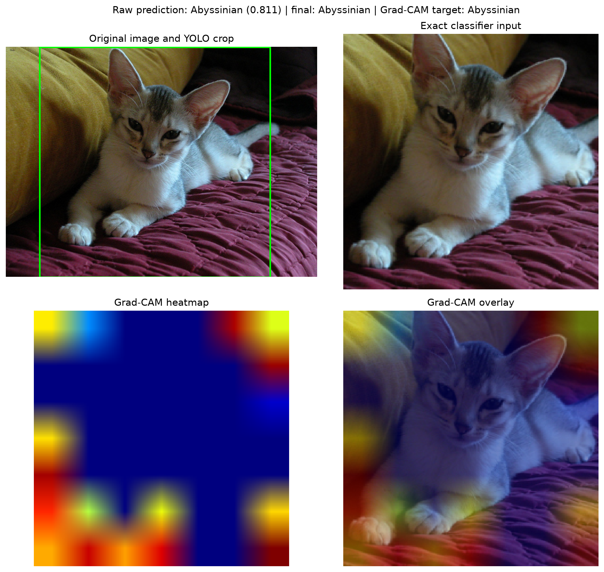

# Swin-Tiny + YOLO Grad-CAM Results

This report documents the reproduced Swin-Tiny experiment and its Grad-CAM
interpretability outputs. The experiment was run on the 4,534 images that were
available on the cluster, using one stratified training/validation split.

> **Dataset scope:** the original manifest contains 5,432 rows, but 898 source
> images were unavailable. These results therefore must not be compared
> directly with runs trained on the complete dataset.
>
> > **Legacy visualization warning:** the Grad-CAM panels in this historical
> report were generated with `last_block_norm1`. A later attribution audit on
> all 143 official-test images found a systematic outer-ring artifact at that
> layer. These panels are retained for reproducibility, but they should not be
> interpreted as reliable localization evidence. New Grad-CAM outputs use the
> audited `stage3_last_norm1` layer.

## Experiment setup

| Component | Setting |
| --- | --- |
| Model | ImageNet-pretrained Swin-Tiny |
| Trainable parameters | 27,535,503 |
| Dataset used | 4,534 available images |
| Split | 3,628 train / 906 validation, stratified, seed 42 |
| Input | 224 × 224 |
| Batch size | 8 |
| Optimizer settings | learning rate `1e-4`, weight decay `1e-4` |
| Regularization | dropout `0.1`, label smoothing `0.1` |
| Schedule | 5 warm-up epochs, 50 maximum epochs |
| Detector preprocessing | YOLOv8n, confidence `0.25`, square crop, `0.10` padding |
| Best checkpoint | epoch 46, selected by validation macro-F1 |
| Training hardware | NVIDIA GeForce RTX 2060, 8 GB |
| Training time | 1,125.76 seconds (18 minutes 45.76 seconds) |

YOLO produced a largest-cat-or-dog crop for 3,557 of the 4,534 images. The
remaining 977 images used the training pipeline's raw-image fallback.

## Validation results

The best checkpoint was evaluated on the 906-image validation split.

| Metric | No confidence threshold | Calibrated threshold `0.50` |
| --- | ---: | ---: |
| Accuracy | 94.26% | **94.59%** |
| Macro precision | 93.08% | **94.28%** |
| Macro recall | **96.30%** | 95.75% |
| Macro-F1 | 94.46% | **94.83%** |
| Weighted-F1 | 94.24% | **94.57%** |
| Reject precision | **98.70%** | 95.92% |
| Reject recall | 88.33% | **91.44%** |
| Reject F1 | 93.22% | **93.63%** |
| False accepts | 30 | **22** |
| False rejects | **3** | 10 |

The threshold was selected by validation accuracy, with macro-F1, reject F1,
false accepts, and false rejects used as tie-breakers. The threshold raises
accuracy by 0.33 percentage points and reduces false accepts by eight, at the
cost of seven additional false rejects.

| Baseline confusion matrix | Threshold `0.50` confusion matrix |
| --- | --- |
|  |  |

Machine-readable results are available in
[`metrics_summary.json`](metrics/metrics_summary.json),
[`threshold_sweep.csv`](metrics/threshold_sweep.csv), and the two confusion
matrix CSV files in this directory.

## Grad-CAM method

These historical panels target `norm1` in the final Swin transformer block
(`last_block_norm1`). This layer is no longer the project default. The
attribution audit selected `stage3_last_norm1`, whose 14 × 14 maps did not show
the final stage's severe outer-ring artifact. Torchvision Swin activations are
channels-last (`[batch, height, width, channels]`), so gradients are averaged
over the two spatial dimensions.

One validation image was selected for each of the 20 animal classes. Each panel
shows the original image, the detector crop, the exact model input, the
Grad-CAM heatmap, and the heatmap overlay. The explanation target is the
classifier's predicted class.

- 20 class samples requested
- 17 passed the YOLO gate and were explained normally
- 3 were rejected by YOLO: Sphynx, Boxer, and Dalmatian
- the 3 detector rejects were rerun as an explicit `--no-yolo` diagnostic
- all 20 selected samples were classified correctly after using that diagnostic
  fallback

The last point describes this deliberately selected qualitative sample and is
not an additional accuracy estimate.

## Per-class panels

| ID | Class | Confidence | Normal pipeline |
| ---: | --- | ---: | --- |
| 0 | [Abyssinian](panels/yolo/00_abyssinian.png) | 0.8106 | YOLO explained |
| 1 | [Bengal](panels/yolo/01_bengal.png) | 0.9207 | YOLO explained |
| 2 | [Birman](panels/yolo/02_birman.png) | 0.9299 | YOLO explained |
| 3 | [Bombay](panels/yolo/03_bombay.png) | 0.9223 | YOLO explained |
| 4 | [British Shorthair](panels/yolo/04_british_shorthair.png) | 0.9292 | YOLO explained |
| 5 | [Maine Coon](panels/yolo/05_maine_coon.png) | 0.9309 | YOLO explained |
| 6 | [Ragdoll](panels/yolo/06_ragdoll.png) | 0.9217 | YOLO explained |
| 7 | [Sphynx detector reject](panels/yolo/07_sphynx_detector_reject.png) | — | [Raw fallback: 0.9211](panels/raw_fallback/07_sphynx.png) |
| 8 | [Tabby](panels/yolo/08_tabby.png) | 0.8843 | YOLO explained |
| 9 | [Tiger Cat](panels/yolo/09_tiger_cat.png) | 0.9143 | YOLO explained |
| 10 | [Beagle](panels/yolo/10_beagle.png) | 0.9303 | YOLO explained |
| 11 | [Pug](panels/yolo/11_pug.png) | 0.9378 | YOLO explained |
| 12 | [Boxer detector reject](panels/yolo/12_boxer_detector_reject.png) | — | [Raw fallback: 0.9313](panels/raw_fallback/12_boxer.png) |
| 13 | [Shiba Inu](panels/yolo/13_shiba_inu.png) | 0.9108 | YOLO explained |
| 14 | [Samoyed](panels/yolo/14_samoyed.png) | 0.9270 | YOLO explained |
| 15 | [Golden Retriever](panels/yolo/15_golden_retriever.png) | 0.8525 | YOLO explained |
| 16 | [German Shepherd](panels/yolo/16_german_shepherd.png) | 0.8843 | YOLO explained |
| 17 | [Siberian Husky](panels/yolo/17_siberian_husky.png) | 0.9183 | YOLO explained |
| 18 | [Dalmatian detector reject](panels/yolo/18_dalmatian_detector_reject.png) | — | [Raw fallback: 0.9246](panels/raw_fallback/18_dalmatian.png) |
| 19 | [Rottweiler](panels/yolo/19_rottweiler.png) | 0.9162 | YOLO explained |

The corresponding filenames and statuses are recorded in
[`gradcam_samples.csv`](metrics/gradcam_samples.csv).

## Qualitative observations

The maps frequently emphasize animal silhouettes, coat regions, and
breed-specific head or body features. Some panels also assign substantial
importance to image borders or background regions. This may indicate context
or acquisition-source shortcuts and should be investigated with a larger,
randomly sampled explanation set and controlled background perturbations.

The three detector rejects are also important: the classifier predicts the
correct breed with high confidence when run directly on each raw image, but the
normal end-to-end pipeline cannot reach the classifier because YOLO rejects the
input. This separates detector-gate failures from classifier failures.

## Limitations

- The 906-image split was used both for model selection and threshold
  calibration; there is no independent held-out test estimate here.
- The experiment uses only the 4,534 available images, not the complete
  5,432-row manifest.
- One intentionally selected image per class is useful for inspection but is
  not a representative quantitative Grad-CAM evaluation.
- Grad-CAM is a coarse localization diagnostic, not a causal explanation.
- The raw-image fallback panels are an ablation and do not represent the normal
  YOLO-gated inference path.
- The displayed panels use the legacy edge-biased target layer and must be
  regenerated with `stage3_last_norm1` before drawing localization conclusions.
  
## Reproduction

See the main [Swin-Tiny Grad-CAM guide](../../gradcam_swin.md) for local and
Slurm commands. The report was generated with confidence threshold `0.50`,
target class `predicted`, and target layer `last_block_norm1`.

