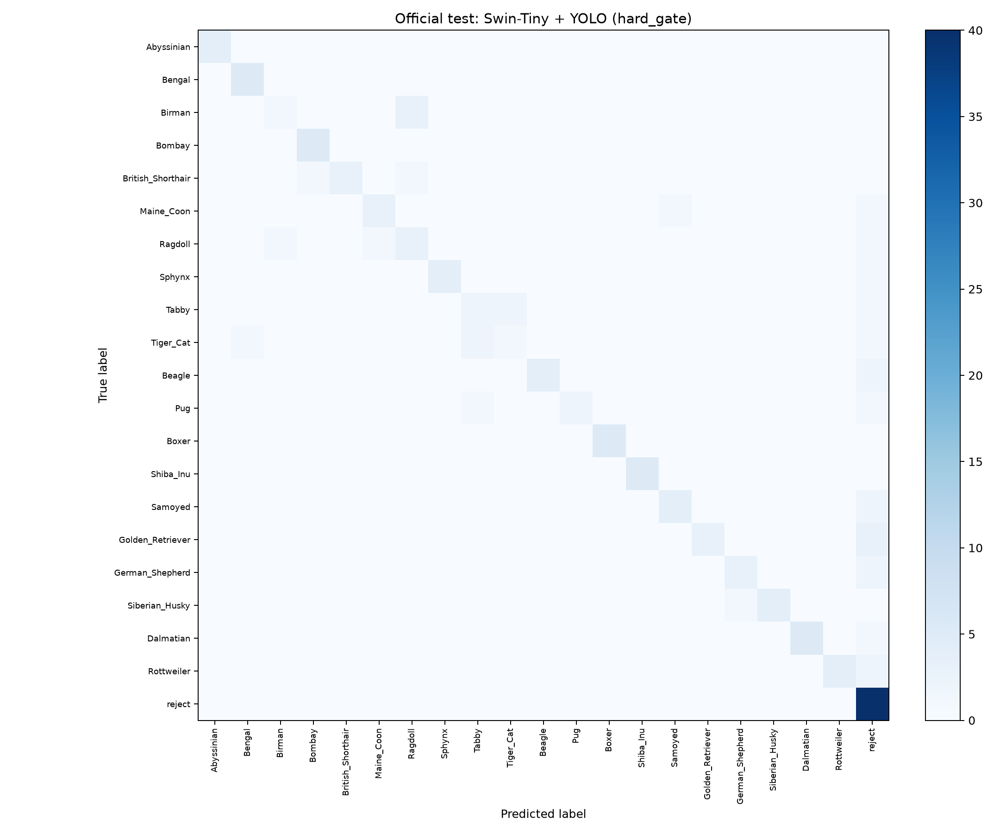
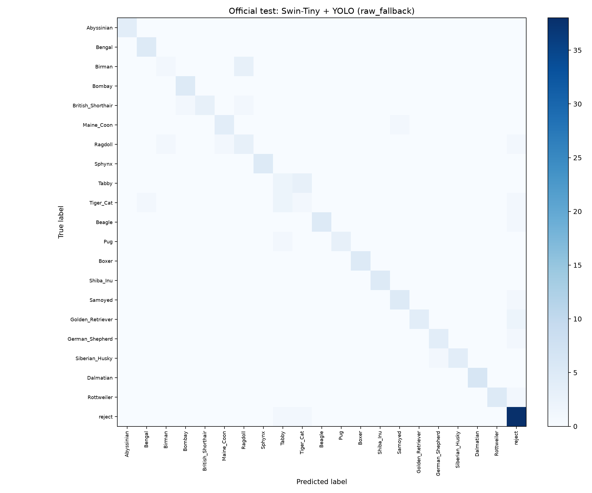

# Swin-Tiny + YOLO Official Test Evaluation with Corrected Grad-CAM

This report summarizes the fixed evaluation on the 143 labelled official-test
images and the corrected `stage3_last_norm1` Grad-CAM rerun.

The model, checkpoint, detector settings, and classifier confidence threshold
were fixed before this evaluation. No threshold tuning, model selection, or
fallback-policy calibration was performed on the official test set.

## Fixed configuration

| Component | Setting |
| --- | --- |
| Swin-Tiny checkpoint | epoch 46 |
| Classifier confidence threshold | `0.50` |
| YOLO detector | YOLOv8n |
| YOLO confidence threshold | `0.25` |
| Crop policy | largest cat/dog detection, square crop, 10% padding |
| Grad-CAM target layer | `stage3_last_norm1` |
| Grad-CAM target class | predicted class |
| Official-test images | 143 |
| Target-animal images | 103 |
| Reject images | 40 |

## Policy comparison

Two inference policies were compared:

- **Hard gate:** if YOLO does not detect a valid cat/dog, the image is rejected
  before Swin runs.
- **Raw fallback:** if YOLO misses the image, Swin is run on the raw image
  instead of immediately rejecting it.

| Policy | Accuracy | Macro-F1 | Weighted-F1 | Reject F1 | False accepts | False rejects |
| --- | ---: | ---: | ---: | ---: | ---: | ---: |
| Hard gate | 76.92% | 73.86% | 75.86% | 81.63% | **0** | 18 |
| Raw fallback | **81.82%** | **79.09%** | **81.60%** | **88.37%** | 2 | **8** |

Raw fallback improved accuracy by 4.90 percentage points and macro-F1 by 5.23
points. It recovered several target animals that YOLO missed, but introduced
two false accepts on reject images. This is a useful trade-off, but it should
be calibrated on validation data rather than tuned on this official test set.

## Detector coverage

- Valid YOLO crops: 90/143 (62.94%)
- Raw fallbacks: 53/143 (37.06%)
- Target-animal YOLO detection rate: 88/103 (85.44%)
- Reject-image YOLO detection rate: 2/40 (5.00%)
- Hard-gate accuracy on detector misses: 71.70%
- Raw-fallback accuracy on detector misses: 84.91%

## Confusion matrices

| Hard gate | Raw fallback |
| --- | --- |
|  |  |

Machine-readable outputs are stored in `metrics/`, including:

- `summary.json`
- `confusion_matrix_hard_gate.csv`
- `confusion_matrix_raw_fallback.csv`
- `per_class_metrics_hard_gate.csv`
- `per_class_metrics_raw_fallback.csv`

## Grad-CAM rerun

The original official-test Grad-CAM run used the legacy final-stage Swin target
layer. After the attribution audit, all 143 official-test explanations were
rerun with `stage3_last_norm1`.

| Output type | Count |
| --- | ---: |
| Requested images | 143 |
| Explained images | 143 |
| Detector rejects in visualization output | 0 |
| Raw-fallback explanations | 53 |
| Panel images | 143 |
| Heatmap PNGs | 143 |
| Overlay PNGs | 143 |
| Metadata JSON files | 143 |
| Raw heatmap arrays (`.npy`) | 143 |

The full generated artifact archive was stored outside the repository as
`swin_official_test_stage3_full.tar.gz`.

## Interpretation

The corrected Grad-CAM run fixed the most important visualization problem:
the final-stage `last_block_norm1` heatmaps had a strong outer-ring artifact,
whereas the `stage3_last_norm1` maps were less dominated by image borders and
kept a higher 14x14 spatial resolution.

The correction does not prove that the model always attends only to the animal.
Some official-test and validation-demo panels still show attention on
background or crop context. Those cases are now more meaningful: they suggest
real shortcut risk, detector/crop effects, or the inherent coarseness of
Grad-CAM rather than a simple color-map reversal.

## Recommended next steps

1. Keep `stage3_last_norm1` as the default Grad-CAM target layer.
2. Use raw fallback only as an explicitly reported policy, not silently mixed
   with hard-gate inference.
3. Calibrate a fallback-specific threshold on validation data only.
4. Investigate target/reject false accepts with background perturbations or
   occlusion tests.
5. Do not tune decisions on the official test set after observing these
   results.
